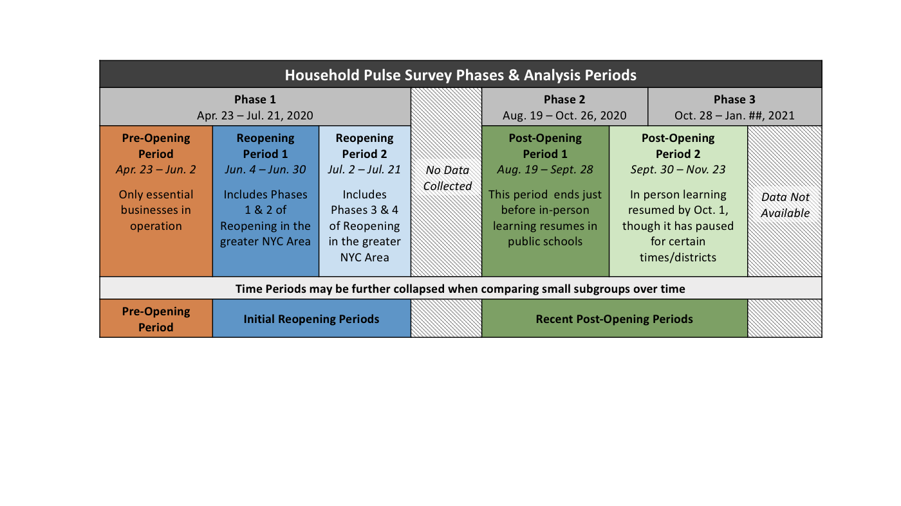
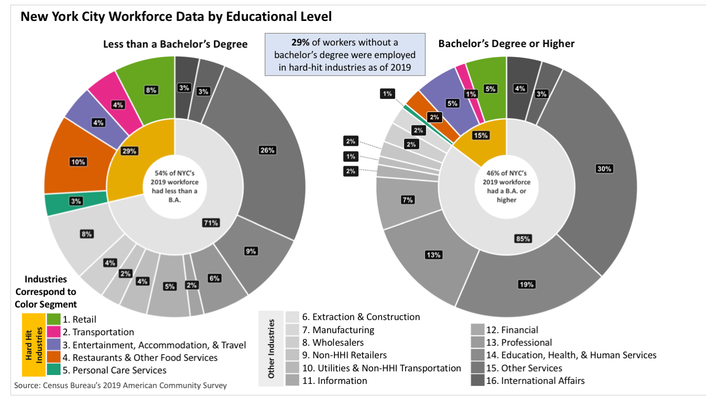
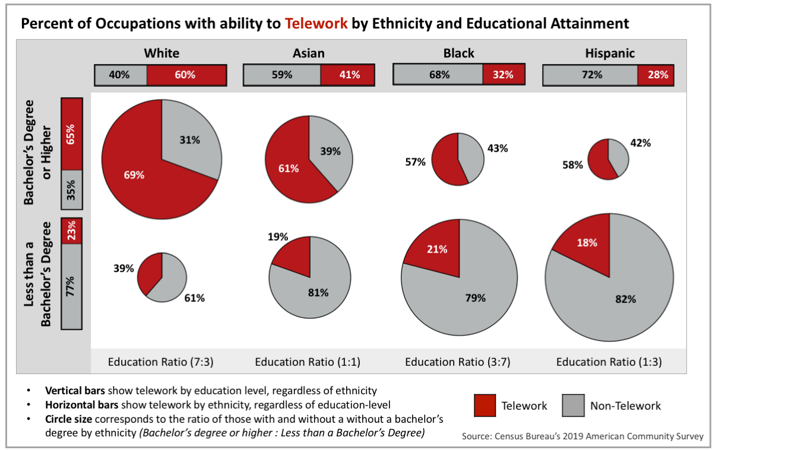

```{r global, include=FALSE, echo = FALSE}
### Load library ####
require(dplyr) || {install.packages("dplyr"); require(dplyr)}
require(tidyr) || {install.packages("tidyr"); require(tidyr)}
require(reshape2) || {install.packages("reshape2"); require(reshape2)}
require(geepack) || {install.packages("geepack"); require(geepack)}
require(ggplot2) || {install.packages("ggplot2"); require(ggplot2)}
require(lme4) || {install.packages("lme4"); require(lme4)}
require(lmerTest) || {install.packages("lmerTest"); require(lmerTest)}
require(stats4) || {install.packages("stats4"); require(stats4)}
require(doBy) || {install.packages("doBy"); require(doBy)}
require(lsmeans) || {install.packages("lsmeans"); require(lsmeans)}
require(data.table) || {install.packages("data.table"); require(data.table)}
require(tibble) || {install.packages("tibble"); require(tibble)}
require(forcats) || {install.packages("forcats"); require(forcats)}
require(gridExtra) || {install.packages("gridExtra"); require(gridExtra)}
require(RColorBrewer) || {install.packages("RColorBrewer"); require(RColorBrewer)}
require(ggrepel) || {install.packages("ggrepel"); require(ggrepel)}
require(DT) || {install.packages("DT"); require(DT)}
require(emmeans) || {install.packages("emmeans"); require(emmeans)}
require(margins) || {install.packages("margins"); require(margins)}
require(paramtest) || {install.packages("paramtest"); require(paramtest)}
require(pwr) || {install.packages("pwr"); require(pwr)}
require(nlme) || {install.packages("nlme"); require(nlme)}


#packageurl <- "https://cran.r-project.org/src/contrib/Archive/pbkrtest/pbkrtest_0.4-4.tar.gz" 
#install.packages(packageurl, repos=NULL, type="source")

### Other set-up features ####
options(dplyr.summarise.inform = FALSE)
cbPalette <- c("#0072B2", "#56B4E9", "#D55E00", "#E69F00")

``` 

```{r setup, include=FALSE}
knitr::opts_chunk$set(echo = TRUE)
```

***

# Introduction

As part of a blog series of COVID’s impact on New York City, I used data from the Census Bureau’s [Household Pulse Survey](https://www.census.gov/programs-surveys/household-pulse-survey.html) (HPS) and [American Community Survey](https://www.census.gov/programs-surveys/acs) (ACS) to examine the pandemic’s impact on employment and financial security in New York City. This document describes the procedure I used to analyze HPS and ACS data for the blog post. The results section highlights a few findings from the analysis, but please see the post for a more comprehensive overview.

<center> [**Link to Blog Post (Writing Sample)**](https://medium.com/nyc-opportunity/the-covid-economy-a-difficult-and-unequal-recovery-24cbe764fcd1) </center>   

&nbsp;  

*Contributions: I wrote the blog post, conducted the supporting analyses, and created the visualizations. Multiple colleagues provided feedback on the framing, editing, analyses, visualizations, and wording. My colleague, Jihyun Shin, wrote part of the technical documentation linked in the post and provided guidance identifying teleworkable occupations and hard-hit industries.*

***

# Predictions & Approach

**Predictions:** At the time of the blog post, job recovery had slowed in the months since reopening began in June 2020. We predicted that data from the Household Pulse survey would reflect this stalled recovery and that disparities in recovery would be especially prominent by race and education level. Specifically, we predicted that (a) respondents with less than a four-year college degree would be more likely than those with a college degree or higher to have experienced pandemic-induced job loss, and (b) non-White respondents would also be more likely than White respondents to have experienced pandemic induced job loss. 

**General Approach:** To help contextualize disparities in pandemic induced job loss, we used 2019 ACS data to examine pre-pandemic workforce characteristics by sector and occupation. Although results from the Household Pulse survey cannot be directly compared to the ACS, we predicted the ACS data would converge with findings from the Pulse survey. Specifically, we predicted that the racial and educational disparities from the Pulse data would reflect demographic differences in employment in hard-hit industries and having an occupation conducive to telework. 

[<a href="#top">Back to top</a>]{style="float:right"}

***

# Analysis Procedure

## Household Pulse Survey 

The Household Pulse Survey provides nation-wide data on individuals’ and households experiences during the pandemic. To examine the pandemic’s impact on employment and financial security, I analyzed all available survey data from when data collection began April 23, 2020 to the latest available time-period ending November 23, 2020. Due to small sample sizes, data were aggregated into five time periods (for details, expand the section below). For technical documentation on the Pulse data, see [this link](https://www.census.gov/programs-surveys/household-pulse-survey/technical-documentation.html)

I specified the survey design in R using the “svrepdesign” function (“survey” package: Lumley, 2004; Lumley, 2010; Lumley, 2020). This function is appropriate for surveys that provide replicate weights for variance estimations, such as the Pulse survey. Data were clustered at the respondent level, and the 80 replicate weights were specified as “successive-difference” (Fay & Train, 1995; Ash, 2014) Employment estimates used person-level sampling weights, consistent with the question framing in the Pulse survey materials.

Analyses were limited to respondents residing in both New York State and the New York City Metropolitan area, which is the smallest geographic area in the Pulse data representative of NYC. Consequently, this sample included responses from all five New York City boroughs, as well as those in Nassau, Suffolk, Westchester, Rockland and Putnam counties. Pandemic-induced job loss estimates were constructed from responses to two employment measures: (1) whether respondents had worked the past seven days for paid wages, and if not, (2) whether they had not recently worked due to COVID-related business shutdowns, including layoffs or furlough. Pandemic-induced job loss was operationalized as the percent of respondents across the sample who met the criteria above. 


<details>
  <summary>*Click for details on the Pulse survey time periods*</summary>



</details>


## American Community Survey

To examine telework and industry, I analyzed 2019 person-level ACS microdata. The data were filtered to only include responses from NYC PUMS areas. Respondents residing in group quarters and under the age of 18 were excluded from analyses. We retained respondents 18 and older to reflect the sample in the Pulse survey. Respondents with occupations in the military or who were unemployed were also excluded for clarity, as they represented only 1.2% of the ACS workforce when including respondents aged 18 and older. Telework was classified according to methodology developed by [Jonathan Dingel and Brent Neiman](https://www.nber.org/papers/w26948), as modified by [Rakesh Kochhar and Jeffrey Passel](https://www.pewresearch.org/fact-tank/2020/05/06/telework-may-save-u-s-jobs-in-covid-19-downturn-especially-among-college-graduates/). Estimates by and across ethnicity and education were weighted by person-weights. Industries were categorized as “hard-hit” according to categorizations from the [Philadelphia Federal Reserve](https://www.philadelphiafed.org/community-development/housing-and-neighborhoods/what-small-businesses-will-be-impacted-by-covid-19) and modified to reflect NYC-specific characteristics.

&nbsp;  
&nbsp;  

[<a href="#top">Back to top</a>]{style="float:right"}

***

# Results

## Pandemic-Induced Job Loss 

Job loss levels plummeted after reopening began. In the final weeks of lockdown, over a quarter of respondents had not worked in the past seven days due to declines in business conditions induced by the pandemic (Pre-Opening Period). By the first month of reopening in June, this rate had fallen to one-fifth (Reopening Period 1). 

Despite these initial improvements, job recovery has slowed since summer. Whereas job loss fell four percentage points from the second reopening period to the first post-opening, it only fell an additional one percentage point between the first and second post-opening periods.

```{r warning=FALSE}
## The code to extract and preprocess and analyze the Pulse data is extensive, so I've not included it in this example. If you would like to view the code, however, I'm happy to provide it upon request.##

## Load relevant results
load("jl_overTime_p1.rda")
load("jl_overTime_p2.rda")

## Prep plot features
x_info <- unique(jl.alone$period)
x_values_toUse <-  c(3.5, 8.5, 12, 15.5, 21, 28)
x_labels_toUse <- c("Pre-Opening",
                    "Opening 1",
                    "Open-\ning 2",
                    "No Data",
                    "Post-Opening 1",
                    "Post-Opening 2")
palette_time_p6v4 <- c("#c85200", "#1170aa", "#5fa2ce", "#a3acb9", "#4e9f50", "#87d180") 

## Plot pandemic-induced job loss over time
ggplot() +
  geom_bar(data = jl.alone ,aes(x = date_num, y = time_area, 
                                #color = fct_reorder(period, as.numeric(time_fact), .desc = FALSE), 
                                fill = fct_reorder(period, as.numeric(time_fact), .desc = FALSE)),
           stat = "identity", width=1, alpha=0.75) +
  scale_fill_manual(values = palette_time_p6v4) +
  scale_color_manual(values = palette_time_p6v4) +
  theme(legend.position = "none") +
  labs(x="", y = "Percent") +
  labs(title="Prevalence of Pandemic-Induced Job Loss across Time", face ="bold") +
  labs(subtitle="Household Pulse Survey Findings for NYC Area from April 23 - November 23, 2020") +
  scale_x_continuous(breaks=x_values_toUse, labels=x_labels_toUse) +
  coord_cartesian(ylim=c(10, 30)) +
  theme(#axis.text.y = element_text(size = 12, face = "plain"),
    axis.title.y = element_text(size = 14),
    title = element_text(size=14, face='bold'),
    plot.subtitle = element_text(size = 10),
    axis.text.y = element_text(size = 12, face='plain'),
    axis.text.x = element_text(angle = 0, hjust = .5, vjust = .5, size = 12),
    axis.ticks.x = element_blank()) +
  theme(panel.grid.minor = element_blank(),
        panel.grid.major = element_blank()) +
  geom_point(data = jl.values, aes(x = date_num, y = percent), color = "black", size = 5) +
  geom_line(data = jl.values, aes(x = date_num, y = percent), color = "black", size = 1) +
  geom_label(data = jl.values, aes(x = date_num, y = percent, label = paste0(round(percent,0),"%")), 
             color = "white", fill = "black", 
             show.legend = FALSE, vjust = 1, nudge_y = -1, size = 5) 
  #geom_ribbon(data = jl.values, aes(x = date_num, ymin=(CIp_2.5), ymax=(CIp_97.5)),alpha=0.3, color = NA)
 

```


[<a href="#top">Back to top</a>]{style="float:right"}

***

## Job Loss by Demographic Groups

Job loss has not meaningfully improved for low-income workers earning less than $50,000 a year since reopening began in June. Initially, job loss fell from 41% during the lockdown period to 27% in June and July. Yet despite these early improvements, job loss remained at 23% across both post-opening periods, a statistically insignificant decrease from the initial reopening periods. Further, job loss remains substantially higher for low-income earners relative to middle- and high-income earners.

There have also been severe racial inequities in the economic impact of the pandemic and in the ongoing economic recovery. White respondents reported the lowest levels of job loss at 12% as of the latest post-opening periods. By contrast, Black and Hispanic respondents reported significantly higher levels of job loss, 19% each, during the same timeframe. Strikingly, job loss rose for Black respondents in the latest post-opening period. This increase did not reach statistical significance, possibly because the sample was too small to detect significant changes over time. 

```{r warning=FALSE}
## The code to extract and preprocess and analyze the Pulse data is extensive, so I've not included it in this example. If you would like to view the code, however, I'm happy to provide it upon request.##

## Load relevant results
load("jlXdemo_p1.rda")
load("jlXdemo_p2.rda")
load("jlXdemo_p3.rda")
load("jlXdemo_p4.rda")

## Prep plot features
palette_time_a3_abbr <- c("#c85200", "#1170aa", "#4e9f50") 
df.cons.forLines <- df.cons %>% 
  select(demo, d_fact, contrast, is_sig) %>% 
  spread(contrast, is_sig)

## Plot pandemic-induced job loss by demographic groups
df.jld %>% 
  ggplot(., aes( x = percent, y = fct_reorder(Demographic, d_order, .desc = TRUE), 
                 group = fct_reorder(Phase, time_fact, .desc = TRUE), 
                 color = fct_reorder(Phase, time_fact, .desc = FALSE))) +
  geom_hline(data = hlines.jl.a3, aes(yintercept = Demographic, linetype=sig_test)) +
  geom_point(size = 1) +
  #geom_text(aes(label = perc_label, color = fct_reorder(Phase, time_fact, .desc = FALSE)), hjust = 0.5,  vjust = -1) +
  geom_label(aes(label = perc_label, fill = fct_reorder(Phase, time_fact, .desc = FALSE)), 
            hjust = 0.5,  
            color = "white",
            label.padding = unit(0.25, "lines"),
            show.legend = F,
            fontface='bold',
            vjust = 0.5) +
  labs(x="Percent", y = "") +
  theme(legend.position = "none") +
  # theme(axis.text.y = element_text(size = 12, face = "plain"),
  #   axis.title.y = element_text(size = 14),
  #   title = element_text(size=16, face='bold'),
  #   plot.subtitle = element_text(hjust = 0.5),
  #   axis.text.y = element_text(size = 12, face='plain'),
  #   axis.text.x = element_text(angle = 0, hjust = 0, vjust = .5, size = 12),
  #   axis.ticks.x = element_blank()) +
  theme(axis.text.y = element_text(size = 12, face='plain'),
        panel.grid.minor = element_blank(),
        #panel.grid.major.y = element_line(color = "black"),
        panel.grid.major.y = element_blank(),
        panel.grid.major.x = element_blank()) +
  scale_fill_manual(values = palette_time_a3_abbr) +
  scale_color_manual(values = palette_time_a3_abbr) 

```

{width=90%}

&nbsp;  

[<a href="#top">Back to top</a>]{style="float:right"}

***

## Pre-Pandemic Employment in Hard-Hit Industries

In New York City, workers without a bachelor’s degree were almost twice as likely than those with a bachelor’s degree or higher to be employed in a hard-hit industry in 2019. This finding converges with results from the Pulse survey, which showed that respondents without a bachelor’s were more likely than those with a bachelor’s or higher to experience job loss.

{width=70%}


&nbsp;  
&nbsp;  
 

[<a href="#top">Back to top</a>]{style="float:right"}

***

## Pre-Pandemic Employment in Teleworkable Occupations

The ability to remote work, also known as telework, helps contextualize economic disparities between racial and educational subgroups in the Household Pulse data. The figure below shows that even within the same education level, White workers were still more likely to have telework-friendly occupations than non-White workers as of 2019. Racial disparities in telework are especially stark for workers without a four-year college degree (bottom row of pie charts). Almost 40% of White workers without a four-year college degree had a telework-friendly occupation. By contrast, non-White workers without a four-year college degree were almost, if not exactly, half as likely to telework: only 21% of Black workers, 19% of Asian workers, and 18% of Hispanic workers without a four-year college degree had teleworkable occupations. More concretely put, a White worker without a bachelor’s is more likely to be an administrative assistant, while a Black worker without a bachelor‘s is more likely to be a receptionist. This difference in telework helps explain, in part, why job loss and financial difficulty have been especially severe for people of color.

{width=70%}

[<a href="#top">Back to top</a>]{style="float:right"}